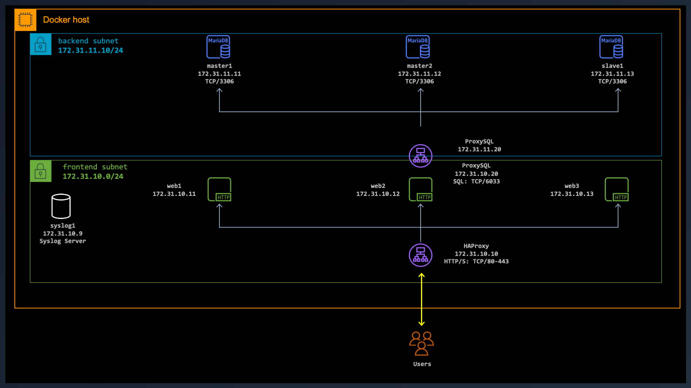

# HAProxy on Docker

## Introduction

In this section, I'll demonstrate how to configure an HAProxy server that fronts a number of web servers. The HAProxy will be hosted on a Docker container with a TCP port exposed on the Docker host. This is the port clients will use to access the web servers behind.

To test the load balancing capability of HAProxy, I've built a Docker container, [here](https://github.com/ddella/PHP8-Nginx) with Nginx and PHP8. The default web page is a leaner version of `phpinfo()`.



## Requirements:

* Familiarity with [Docker](https://www.docker.com/).
* Docker Desktop installed locally.

### Start a syslog server

See my other workshop on starting a basic Syslog-NG server [here](https://github.com/ddella/Syslog-NG). The logs from HAProxy will be sent to this syslog server.

## Let's build the HAProxy

1. Get the official Docker image from Docker hub.
2. Edit the `haproxy.cfg` file to reflect our configuration.
3. Start the HAProxy container.
4. Start some web servers to test HAProxy.

### Get the official HAProxy

Open a `terminal` and change the directory to where all the HAProxy files are. That should be `$PWD/haproxy`.

```sh
cd $PWD/HAProxy
```

Pull the official image from Dockder hub.

```sh
docker pull haproxy
```

### Start HAProxy

Note that your host's `$PWD/haproxy/conf` folder should be populated with a file named `haproxy.cfg`. If this configuration file refers to any other files within that folder then you should ensure that they also exist (e.g. template files such as 400.http, 404.http, and so forth).

```sh
docker run -d \
--name haproxy1 \
--hostname haproxy1 \
--network frontend \
-p 8080:80 \
-p 8443:443 \
--ip 172.31.10.10 \
--env TZ='EAST+5EDT,M3.2.0/2,M11.1.0/2' \
-v $PWD/conf:/usr/local/etc/haproxy:ro \
--sysctl net.ipv4.ip_unprivileged_port_start=0 \
haproxy
```

# how to test HAProxy
# docker run -d --name haproxy --network frontend --ip 172.31.10.20 -p 8080:80 -v $PWD:/usr/local/etc/haproxy:ro --sysctl net.ipv4.ip_unprivileged_port_start=0 haproxy
# docker run --rm -d --name web1 --network frontend --ip 172.31.10.11 php8_nginx
# docker run --rm -d --name web2 --network frontend --ip 172.31.10.12 php8_nginx
# docker run --rm -d --name web3 --network frontend --ip 172.31.10.13 php8_nginx
# from a shell on the Docker host, access the HAProxy on the listening port
# curl http://localhost:8080
