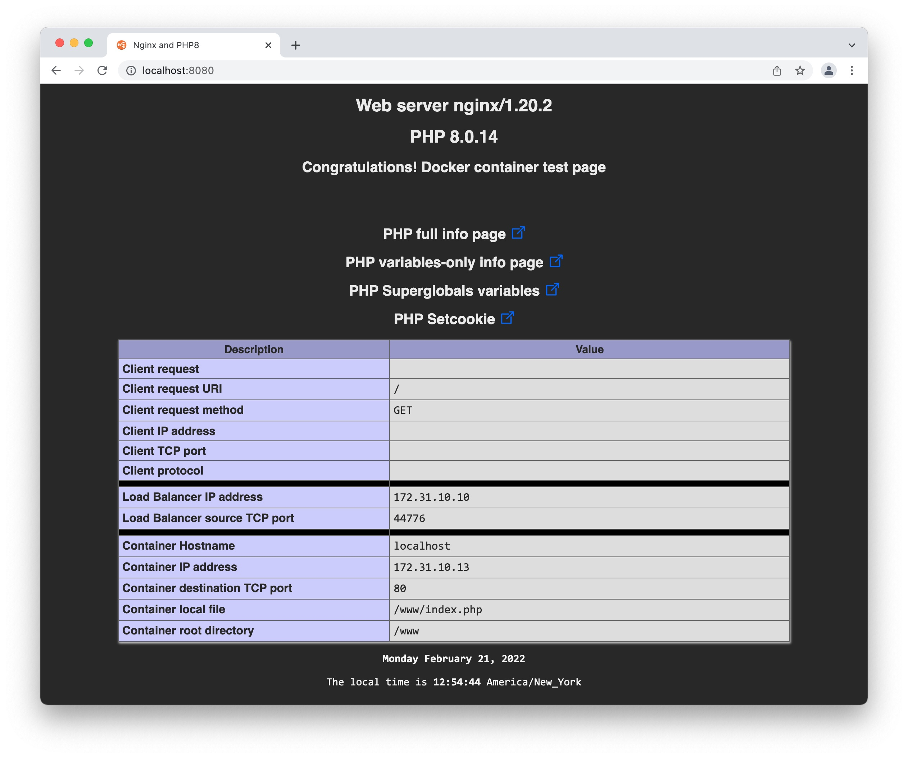

# Start the web servers

## Introduction

In this section, we'll start web servers from a Docker container. We'll use a container from my other workshop found [here](https://github.com/ddella/PHP8-Nginx).

The web servers runs on Alpine Linux mini root-fs, with Nginx and PHP8.


## Requirements:

* Familiarity with [Docker](https://www.docker.com/).
* Docker Desktop installed locally.

## Let's get the image and start the container

### Get the `php8_nginx` image

I did a workshop, that you can find [here](https://github.com/ddella/PHP8-Nginx), to build a simple web server with Nginx and PHP8. The default page has all the information to see the load balancing

You can use your own.

### Docker Compose

To start the web servers, I'm using Docker Compose. Here's the `yaml`file:

```yaml
# start the containers
#     docker-compose -f web-compose.yaml up -d
#
# stop and terminate all the containers:
#     docker rm -f $(docker container ls -q -f "name=web[1-3]")

networks:
   frontend:
      name: frontend

services:
  web1:
    image: php8_nginx
    restart: unless-stopped
    environment:
      - TZ=EAST+5EDT,M3.2.0/2,M11.1.0/2
      - TIMEZONE=America/New_York
    hostname: web1
    container_name: web1
    networks:
      frontend:
        ipv4_address: 172.31.10.11

  web2:
    image: php8_nginx
    restart: unless-stopped
    environment:
      - TZ=EAST+5EDT,M3.2.0/2,M11.1.0/2
      - TIMEZONE=America/New_York
    hostname: web2
    container_name: web2
    networks:
      frontend:
        ipv4_address: 172.31.10.12

  web3:
    image: php8_nginx
    restart: unless-stopped
    environment:
      - TZ=EAST+5EDT,M3.2.0/2,M11.1.0/2
      - TIMEZONE=America/New_York
    hostname: web3
    container_name: web3
    networks:
      frontend:
        ipv4_address: 172.31.10.13
```

### Start the web servers

Adjust the timezone, network and IP address in the `yaml` file.

Open a `terminal` and change the directory to where all the web server files are located. That should be `$PWD/web-servers`.

```sh
 docker-compose -f web-compose.yaml up -d
```

### Stop the web servers

This will stop and terminate all the web servers.

```sh
docker rm -f $(docker container ls -q -f "name=web[1-3]")
```

### Test the web servers

Open your prefered web browser and type the url `http://localhost:8080`. The page should look like this. Hit reload and check the field `Container IP address`. This is the IP address of the web server that serviced the request.



### Clean the log file

Clean the log file from the log generated in the step above:

```sh
: > logs/syslog
```
